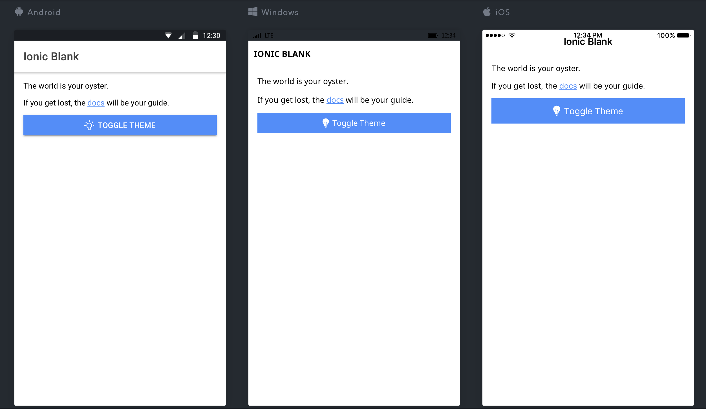
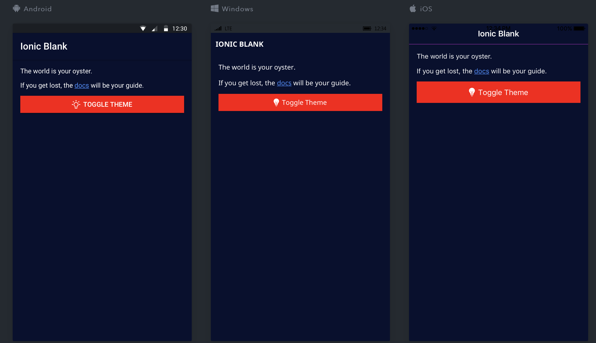

# Ionic Dynamic Theming 
This repo hold an example of dynamic theming in an ionic app. The technique involves switching between sass files at runtime to change the appearance of the UI.

## Preview

Light Mode: 

Dark Mode: 

## Installation

* [Download the installer](https://nodejs.org/) for Node.js 6 or greater.
* Install the ionic CLI globally: `npm install -g ionic`
* Clone this repository: `git clone https://github.com/ionic-team/ionic-dynamic-theming.git`.
* Run `npm install` from the project root.
* Run `ionic serve` in a terminal from the project root.
* Profit. :tada:

_Note: You may need to add “sudo” in front of any global commands to install the utilities._

## References
To learn more about Ionic, [visit this webpage](http://ionicframework.com).

To learn more about Typescript, [visit this webpage](https://www.typescriptlang.org)

This repo was inspired by this [article](https://devdactic.com/dynamic-theming-ionic/)